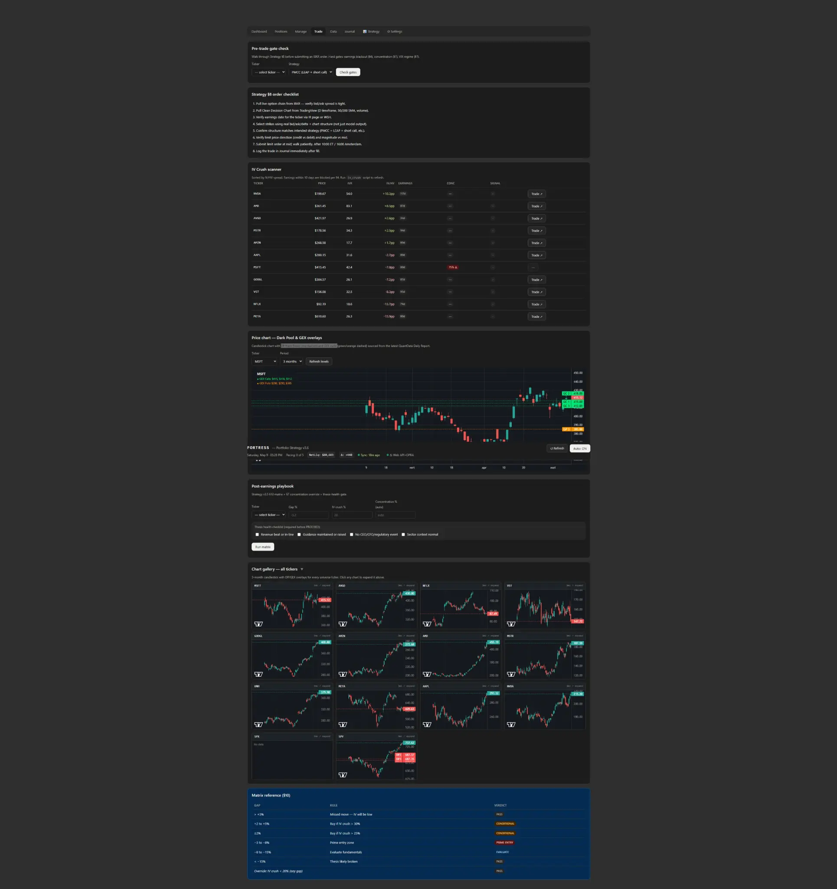

# Fortress Dashboard 2026

An autonomous options portfolio strategy dashboard designed to bridge the gap between algorithmic trade execution and human strategic oversight.

Fortress is not an auto-trader; it is a **strategy management layer** that reads your live Interactive Brokers portfolio, evaluates it against your chosen trader persona rules (e.g. Income Seeker, Volatility Trader), and generates plain-English narratives, alerts, and execution candidates.



## Core Features

- **Trader Personas:** Switch between 5 predefined profiles (Income Seeker, Speculator, Volatility Trader, Hedger, PMCC) to instantly reconfigure risk tolerances and strategy rules.
- **Live Strategy Narrative:** A generative plain-English briefing of your portfolio's state, macro regime, and concentration risks.
- **Automatic Strategy Inference:** Automatically classifies raw IBKR positions into 24 distinct options strategies (Iron Condors, PMCCs, Collars, etc.) based on leg structure.
- **Pre-trade Gate Checks:** Validates intended trades against earnings blackouts, concentration limits, and VIX regime rules.
- **Chart Gallery:** 3-month candlestick charts with Dark Pool floor and GEX wall overlays for every universe ticker, rendered directly in the Trade tab.
- **Security First:** No internet exposure required (designed to run behind Tailscale/VPN). API keys and passwords stay on your VPS.
- **Backup & Restore:** Easily export and import all dashboard settings and configurations as JSON.


## MCP Server (Claude Integration)

The  directory contains the MCP server that exposes Fortress data and actions to Claude Desktop.

**40 tools across 3 tiers:**
- **Tier 1 — Read (25 tools):** , , , , , , , , and more
- **Tier 1b — QuantData live (6 tools):** , , , , , 
- **Tier 2 — Write / gated (9 tools):** , , , , , , and more (require )

**Setup:** Copy  into your  and set  to .

## Dashboard Tabs Overview

The dashboard is organized into 8 functional tabs:

| Tab | Function |
|---|---|
| **Dashboard** | High-level overview: NetLiq, available funds, pacing, macro regime, concentration limits, portfolio Greeks, and the IV Crush candidate scanner. |
| **Positions** | Live view of all active positions synced from Interactive Brokers, with automatically inferred strategy labels. |
| **Manage** | Stop-loss evaluator, roll candidate evaluator, and manual triggers for workflow scripts. |
| **Trade** | Pre-trade gate check, §8 order checklist, TradingView price chart with DP/GEX overlays, post-earnings playbook matrix, and chart gallery for all universe tickers. |
| **Data** | Manage the active ticker universe, view the earnings calendar, sync from IBKR, and manage file uploads. |
| **Journal** | Trade logging and history. |
| **Strategy** | Select your Trader Persona, read the live Strategy Narrative, configure 24 different strategy parameters, and manage alerts/thresholds. |
| **Settings** | Configure technical infrastructure, security keys, UI preferences, and Backup/Restore functionality. |

## External Data Dependencies

### Interactive Brokers (Required)

The core portfolio management, positions syncing, and strategy inference rely entirely on Interactive Brokers via the **IBKR Web API** (the modern REST-based API introduced in TWS 10.19+). No IB Gateway or ibeam Docker container is required.

The IBKR Web API is enabled directly in Trader Workstation (TWS) under **Edit → Global Configuration → API → Settings**. The dashboard connects to it on `localhost:5055` by default. If the Web API is unavailable, the backend automatically falls back to BS-yfinance for price data.

The Web API toggle and fallback behaviour are configurable in **Settings → Security**.

### QuantData.us (Optional but Highly Recommended)

While the dashboard is fully functional without it, the **Run workflow scripts** feature (in the Manage tab) heavily depends on the [QuantData.us](https://quantdata.us) live API.

QuantData provides the underlying market intelligence for:
- Pre-market IV rank scanning (configurable lookback)
- IV Crush reporting (which populates the Dashboard candidate scanner)
- Whale flow and dark pool alerts
- Max pain and EOD reviews
- Macro regime extraction and Dark Pool/GEX overlays on the price chart
- Live order flow sweeps and blocks (Gate 6 confirmation)

**If you do not use QuantData:** The dashboard will still manage your portfolio, evaluate stops/rolls, and run the strategy narrative. However, the candidate scanner will be empty, the macro regime will show as "unknown", the chart overlays will be missing, and the workflow scripts will fail.

You will need a QuantData Auth Token and Instance ID configured in the **Settings > Security** tab to unlock these features. The QuantData integration can be disabled entirely via the `use_quantdata` toggle in Settings, which suppresses all dependent features gracefully rather than erroring. Daily CSV report uploads are still supported as a fallback if the live API is unavailable.

## Installation

### Prerequisites
- A Linux VPS (Ubuntu 22.04/24.04 recommended)
- **Interactive Brokers account** with TWS running and the IBKR Web API enabled
- *(Optional)* **QuantData.us API Key** (required for workflow scripts and market intelligence)

### 1-Click Install

Clone the repository and run the install script:

```bash
git clone https://github.com/YOUR_USERNAME/options-portfolio-strategy-dashboard-2026.git
cd options-portfolio-strategy-dashboard-2026
./install.sh
```

The script will:
1. Install Python dependencies and create a virtual environment.
2. Generate a secure `FORTRESS_API_TOKEN`.
3. Set up and start the `fortress-dashboard` systemd service.
4. Copy the example configuration to the runtime data directory.

The dashboard will be available at `http://<your-vps-ip>:8080`.

### Configuration
1. Open the dashboard in your browser.
2. Navigate to the **Settings** tab.
3. Under the **Security** section, enter your IBKR Account ID, enable the IBKR Web API toggle, and add your QuantData API key if applicable.
4. Save the settings.

## Documentation

Full documentation is available in the `docs/` folder:
- [Portfolio Strategy v3.6](docs/01_Portfolio_Strategy_v3_6.md) — The core trading logic and rules engine.
- [Dashboard Build Spec v1.8](docs/02_Trading_Dashboard_Build_Spec_v1_8.md) — Architecture and API design.
- [Trading Workflow v2.8](docs/03_Trading_Workflow_v2_8.md) — Step-by-step trade execution workflow.
- [VPS Implementation Guide v1.5](docs/04_VPS_Implementation_Guide_v1_5.md) — Deployment, IBKR Web API setup, and security hardening.
- [Implementation Status](docs/05_Implementation_Status.md) — Current feature completion and known gaps.

## CI/CD Deployment

This repository includes a GitHub Actions workflow for automatic deployment.
To enable auto-deploy on push to `main`:

1. Go to your repository **Settings > Secrets and variables > Actions**.
2. Add the following secrets:
   - `VPS_HOST`: Your VPS IP address
   - `VPS_USER`: Your SSH username (e.g., `ubuntu`)
   - `VPS_SSH_KEY`: Your private SSH key (without passphrase)
   - `VPS_APP_PATH`: The absolute path to the app (e.g., `/home/ubuntu/options-portfolio-strategy-dashboard-2026`)
   - `SERVICE_NAME`: `fortress-dashboard`

## Disclaimer
This software is for informational and educational purposes only. It is not financial advice. Trading options involves significant risk. Always verify data and candidates before executing trades in your brokerage account.
